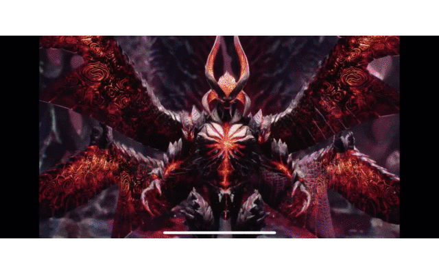

## CustomPageView
* 自定义实现UIPageViewController,location-Mid翻页效果

## 内容简介
* [需求来源](#birth_reason)
* [如何使用](#how_to_use)
* [效果展示](#show_gif)
* [关键代码](#source_code)

## <a id="birth_reason"></a>需求来源
* 由于项目中新增绘本的需求，需要实现类似书本翻页的效果，系统控件UIPageViewController自带书本翻页的功能，且支持，左轴，中轴，右轴三种效果，且带有折叠阴影等效果，但是需求却不需要折叠阴影，趋向于硬质的图片相册翻页效果，调研系统的UIPageViewController并不支持高度自定义相关的功能，于是自己动手写了一个轮子；轮子中用到了第三方的iCarousel库，这个库主要帮助处理滚动的位移的相关计算，使我不用操心元素的位移，把重点放在元素的transform的处理上。

## <a id="how_to_use"></a>如何使用
* 工程依赖第三方库iCarousel,需要先在podfile文件中添加引用：

	```
	# Uncomment the next line to define a global platform for your project
	# platform :ios, '9.0'
	
	target 'UIPageViewController-SpineLocationMid' do
	  # Uncomment the next line if you're using Swift or would like to use dynamic frameworks
	  # use_frameworks!
	pod 'iCarousel', '~> 1.8.3'
	  # Pods for UIPageViewController-SpineLocationMid
	
	end
	```
* 导入头文件CostomPageView.h到控制器中
* 添加布局代码
	
	```objc
	//1.创建CustomPageView
	CustomPageView *pageView = [CustomPageView pageViewWithFrame:self.view.bounds];
	//2.指定图片的拉伸模式，参考UIImageView的contenMode相同的效果
    pageView.contentMode = UIViewContentModeScaleAspectFit;
    //3.给pageView指定一个图片数组
    pageView.imageArray = self.imageArray;
    //4.添加到指定的控件上
    [self.view addSubview:pageView];
	```

## <a id="show_gif"></a>效果展示

		
## <a id="source_code"></a>关键代码

* 所有元素的仿射变换都在下面这个方法中处理

```objc
- (CATransform3D)carousel:(iCarousel *)carousel itemTransformForOffset:(CGFloat)offset baseTransform:(CATransform3D)transform
{
    transform.m34=-3/2000;//透视效果
    double angle = 0;
    double translateZ = -1;
    NSArray *visibleViews = [carousel visibleItemViews];
    for (UIView *currentView in visibleViews) {
        CGFloat offset = [carousel offsetForItemAtIndex:[carousel indexOfItemView:currentView]];
        UIImageView *backImageView =  currentView.subviews[0];
        UIImageView *frontImageView =  currentView.subviews[1];
        if (offset > -0.5) {
            frontImageView.layer.zPosition = 1;
            backImageView.layer.zPosition = 0;
        }else{
            backImageView.layer.zPosition = 1;
            frontImageView.layer.zPosition = 0;
        }
    }
    if (offset >=-1 && offset <= 0) {
        angle = -M_PI * offset ;
        translateZ = offset;
        
    }else if(offset < -1){
        angle = -M_PI;
    }
    transform=CATransform3DRotate(CATransform3DTranslate(transform, 0, 0, cos(M_PI_2 / self.dataSource.count * 0.5 * offset * 0.001)),angle ,0,-1,0);
    return transform;
}
```
	 

